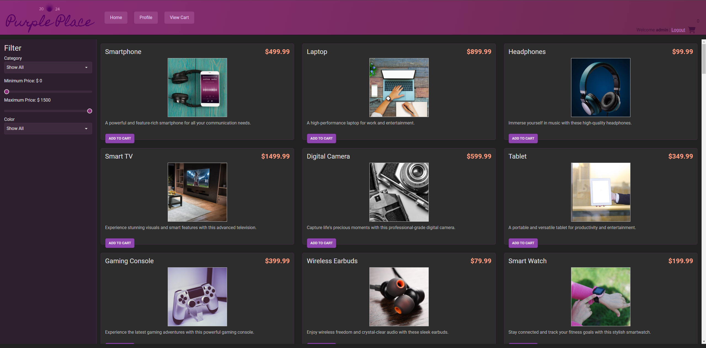
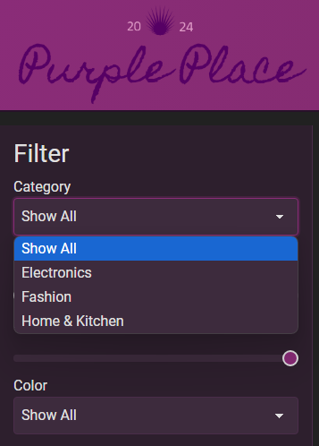
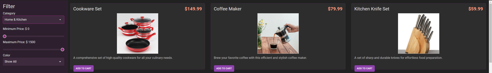
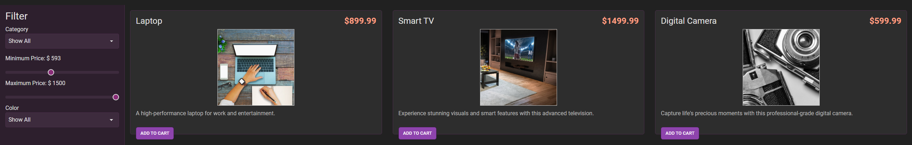
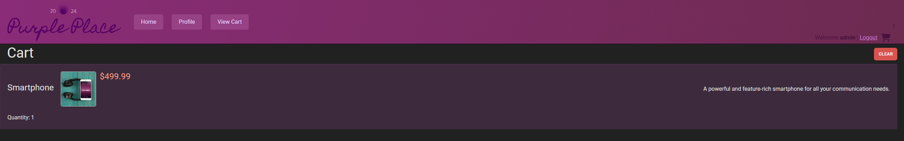
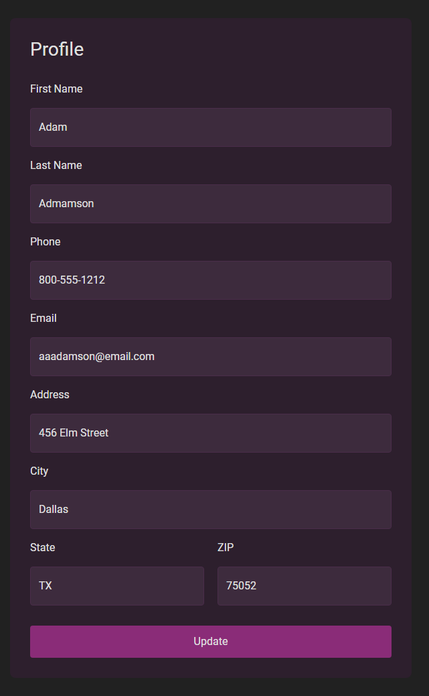
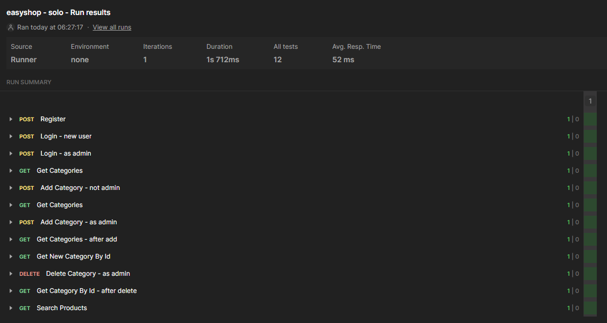
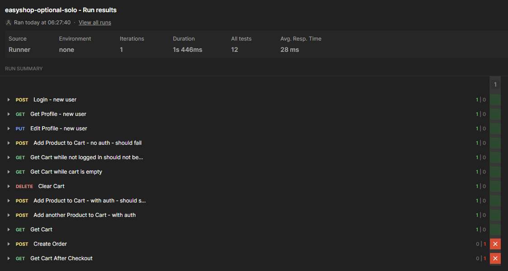

# EasyShop API 🛒

Welcome to **EasyShop API**! This application provides a complete backend service to power an online shopping platform. Built using Java and Spring Boot, the API focuses on delivering a seamless shopping experience for customers while offering robust tools for administrators to manage products and categories efficiently. Whether you're browsing products or updating your cart, this API ensures functionality, scalability, and ease of use.



---

## Table of Contents

- [Overview](#overview)
- [Features Implemented](#features-implemented)
    - [Phase 1: Categories Controller](#phase-1-categories-controller)
    - [Phase 2: Fix Bugs in Product Search and Duplication](#phase-2-fix-bugs-in-product-search-and-duplication)
    - [Phase 3: Shopping Cart](#phase-3-shopping-cart)
    - [Phase 4: User Profile](#phase-4-user-profile)
    - [Phase 5: Checkout (Not Implemented)](#phase-5-checkout-not-implemented)
- [Postman Collections](#postman-collections)
- [Code Highlight](#code-highlight)

---

## Overview

The EasyShop API is designed to handle the backend logic for an e-commerce application. It supports product browsing, category management, shopping cart functionality, and user profile updates. Administrators have access to advanced tools for managing the store's inventory, ensuring customers always have a smooth shopping experience.

### Goals

1. **User-Centric Design**: Simplify the process of browsing, selecting, and purchasing products.
2. **Administrator Efficiency**: Provide robust tools for managing products and categories.
3. **Modular Architecture**: Facilitate scalability and ease of maintenance for future enhancements.

---

## Features Implemented

### Phase 1: Categories Controller

The first phase focused on implementing a **CategoriesController** to manage product categories. This included adding, updating, deleting, and retrieving categories. Only administrators with the proper role (`ADMIN`) can perform these actions, ensuring secure and organized management of the store's catalog.

**Endpoints:**

- **GET /categories**: Fetch all categories.
- **POST /categories**: Add a new category.
- **PUT /categories/{id}**: Update an existing category.
- **DELETE /categories/{id}**: Delete a category.

Categories help structure the store inventory, making it easier for users to find products of interest. The implementation ensures data integrity and user-friendliness.





---

### Phase 2: Fix Bugs in Product Search and Duplication

The second phase tackled critical bugs affecting product search and duplication. These fixes enhanced the user experience and database integrity.

- **Bug 1: Product Search Logic**  
  The search functionality had issues with returning incorrect results when filtering by parameters like `categoryId`, `minPrice`, `maxPrice`, and `color`. This was resolved by revising the search logic to properly handle and combine these parameters.

- **Bug 2: Product Duplication**  
  A product update was unintentionally creating duplicate entries in the database. This issue was fixed by ensuring updates modified the existing product records instead of inserting new ones.

**Endpoints:**

- **GET /products**: Retrieve all products or filter by parameters.
- **POST /products**: Add a new product.
- **PUT /products/{id}**: Update product details.
- **DELETE /products/{id}**: Remove a product.



---

### Phase 3: Shopping Cart

In this phase, the shopping cart functionality was developed, allowing users to add, update, or remove items. The cart is an essential feature that lets users review their selected products before checkout.

**Endpoints:**

- **GET /cart**: Retrieve the user's current cart.
- **POST /cart/products/{id}**: Add a product to the cart.
- **PUT /cart/products/{id}**: Update the quantity of a product in the cart.
- **DELETE /cart**: Clear the entire cart.

The implementation ensures cart actions are intuitive and responsive, enhancing the overall shopping experience.



---

### Phase 4: User Profile

User profiles were introduced in this phase, allowing users to store and manage their personal information. A profile is automatically created upon registration, and users can update their details as needed.

**Endpoints:**

- **GET /profile**: Retrieve the user's profile.
- **PUT /profile**: Update user details.

The profile feature ensures a personalized shopping experience by keeping user preferences and details accessible.



---

### Phase 5: Checkout (Not Implemented)

This phase was intended to implement the checkout process, allowing users to convert their shopping cart into a finalized order. While not yet complete, this feature would include the creation of order line items and processing transactions.

**Planned Endpoint:**

- **POST /orders**: Create a new order from the cart.

---

## Postman Collections

### Collection 1: Authentication and Category Management

This collection tests endpoints for user authentication and category operations.



### Collection 2: Product and Cart Operations

This collection verifies product retrieval, addition to the cart, and cart updates.



---

## Code Highlight

Below is a complex and critical segment that handles shopping cart retrieval and its association with products in the database:

```java
@Override
public ShoppingCart getByUserId(int userId) {
    ShoppingCart shoppingCart = new ShoppingCart();

    String sql = "SELECT shopping_cart.*, products.* " +
                 "FROM shopping_cart " +
                 "JOIN products " +
                 "ON shopping_cart.product_id = products.product_id " +
                 "WHERE shopping_cart.user_id = ?";

    try (Connection connection = this.getConnection()) {
        PreparedStatement statement = connection.prepareStatement(sql);
        statement.setInt(1, userId);
        ResultSet row = statement.executeQuery();
        while (row.next()) {
            int quantity = row.getInt("quantity");
            Product product = new Product();
            product.setProductId(row.getInt("products.product_id"));
            product.setName(row.getString("name"));
            product.setPrice(row.getBigDecimal("price"));
            product.setCategoryId(row.getInt("category_id"));
            product.setDescription(row.getString("description"));
            product.setColor(row.getString("color"));
            product.setStock(row.getInt("stock"));
            product.setFeatured(row.getBoolean("featured"));
            product.setImageUrl(row.getString("image_url"));

            ShoppingCartItem shoppingCartItem = new ShoppingCartItem();
            shoppingCartItem.setProduct(product);
            shoppingCartItem.setQuantity(quantity);
            shoppingCart.add(shoppingCartItem);
        }
    } catch (SQLException e) {
        throw new RuntimeException(e);
    }
    return shoppingCart;
}
```
This method demonstrates the combination of SQL queries and Java object mapping to retrieve a user's shopping cart. It handles:

- **SQL Joins**: To combine cart data with product details.
- **ResultSet Processing**: Mapping database rows to Java objects.
- **Object Composition**: Building a `ShoppingCart` object that contains `ShoppingCartItem` instances.

This level of database interaction ensures data integrity and provides a seamless experience for users managing their carts.